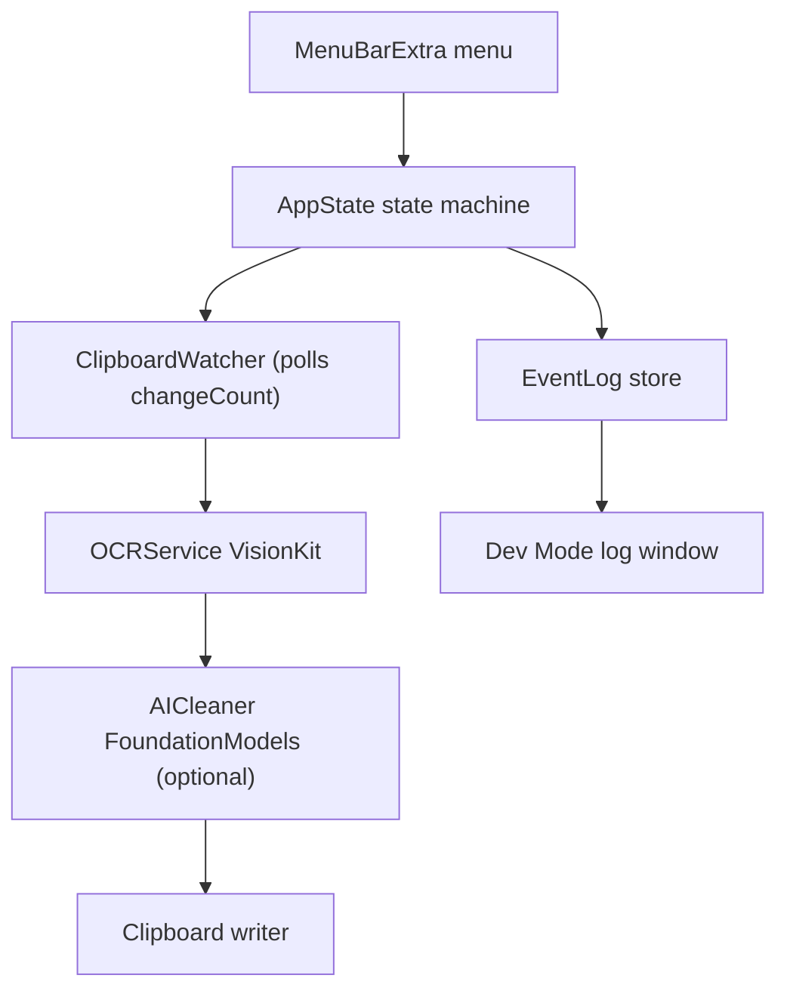

---
tags:
  - vibecode
  - build-plan
project: CopyText
status: active
---

# CopyText MVP Build Plan

Menu bar macOS app: screenshot → native OCR → clipboard. Optional AI cleanup via Apple Foundation Models.

→ [[VibeCodeProjects/2026 CopyText/about_CopyText_MacApp|about_CopyText_MacApp]] · [[Product Ideas/idea_CopyText|idea_CopyText]]

---

## Stack

| Layer | Choice |
|-------|--------|
| Language | Swift |
| UI | SwiftUI `MenuBarExtra` |
| Min target | macOS 13+ (MenuBarExtra API; bump from idea's macOS 12) |
| OCR | Vision `VNRecognizeTextRequest` |
| AI cleanup | FoundationModels (Apple Intelligence Macs only) |
| Persistence | `UserDefaults` for toggles |
| Logging | `os.Logger` + rotating file in `~/Library/Logs/CopyText/` |

No cloud, no API keys, no third-party OCR. Clipboard read/write needs no special permissions.

---

## Architecture



### Suggested file structure

```
CopyText/
├── CopyTextApp.swift          # @main, MenuBarExtra, scene setup
├── AppState.swift             # State machine + icon mapping
├── ClipboardWatcher.swift     # Poll changeCount, detect images
├── OCRService.swift           # VNRecognizeTextRequest wrapper
├── AICleaner.swift            # FoundationModels pass (optional)
├── EventLog.swift             # Timestamped log entries + file mirror
├── DevLogWindow.swift         # SwiftUI log viewer (Dev Mode only)
├── MenuContentView.swift      # Menu items: Start, Cancel, toggles, Quit
└── Assets.xcassets            # App icon + menu bar icon states
```

---

## State machine

```
idle → waiting → processing → success/failure → idle
```

| State | Menu bar icon | User action |
|-------|---------------|-------------|
| **idle** | Default icon | Can click Start |
| **waiting** | Waiting icon (e.g. camera/viewfinder) | Take screenshot with native tool; Cancel available |
| **processing** | Busy icon (animated dots) | Wait 1–5s; Start disabled |
| **success** | Checkmark (brief flash) | Paste with ⌘V; auto-return to idle |
| **failure** | Warning (brief flash) | Clipboard untouched; auto-return to idle |

The **processing** state covers the full pipeline — OCR alone, or OCR + AI Mode. It enters as soon as an image is detected on the clipboard and exits on success or failure. This gives visible feedback during the 1–5 second processing window so the user knows the app is working, not stuck.

While processing: Start is disabled, new clipboard changes are ignored (one-shot lock).

---

## User flow

### Idle

App sits in menu bar. User opens menu → clicks **Start**.

### Waiting for screenshot

After Start:

- Enters **waiting** state
- Stores current clipboard change count
- Polls clipboard every 0.3s until it changes
- Waits until an image appears — nothing else happens

### User takes screenshot

User captures with native macOS tool (e.g. `⌘⇧4`) configured to copy to clipboard. Screenshots only the text they want. No CopyText interaction needed.

### Detect screenshot

CopyText detects:

1. Clipboard changed
2. Clipboard content is an image (`public.png` / `public.tiff`)

Then: stop polling, enter **processing**, begin OCR. One-shot operation.

### OCR processing

- Reads image from clipboard
- Native macOS OCR (Vision)
- No cloud, no external API — all local

### Success

- Replace clipboard with extracted text
- User pastes with `⌘V`
- Menu bar icon → success state
- Return to idle after brief delay

### Failure

- Do not modify clipboard
- Menu bar icon → warning state
- Return to idle after brief delay

---

## AI Mode (optional)

Toggle in menu: **AI Mode**

**Disabled:**

```
Screenshot → Vision OCR → Clipboard = raw OCR text
```

**Enabled:**

```
Screenshot → Vision OCR → Apple Foundation Models → clean OCR output → Clipboard = refined text
```

AI instructions:

- Correct OCR mistakes
- Preserve paragraphs and line breaks
- Keep original wording
- Never summarize or rewrite intentionally
- Return plain text only

Best for: low-quality screenshots, blurry text, YouTube subtitles, UI mockups, PDFs, small fonts.

**Requirements:** Apple Intelligence Mac + Foundation Models available. Toggle only shown on supported systems; otherwise hidden. On AI error, fallback to raw OCR text and log the failure.

---

## Milestones

### Milestone 1 — Skeleton (menu bar app)

**Goal:** Runnable menu bar app with state-driven icons.

- [ ] Create Xcode project (macOS App, SwiftUI, no document-based UI)
- [ ] Set deployment target to macOS 13
- [ ] `MenuBarExtra` with icon + dropdown menu
- [ ] Menu items: Start, Cancel, AI Mode toggle, Dev Mode toggle, Quit
- [ ] `AppState` enum: `idle`, `waiting`, `processing`, `success`, `failure`
- [ ] Icon variants per state (idle / waiting / processing / success / warning)
- [ ] Processing icon: distinct busy glyph or subtle animated variant (e.g. cycling SF Symbol dots)
- [ ] Disable Start while in `waiting` or `processing`
- [ ] Cancel only visible in `waiting`; returns to idle

**Done when:** App launches to menu bar, menu items respond, icons change on manual state transitions (hardcoded for testing).

---

### Milestone 2 — Clipboard watcher

**Goal:** Detect screenshot-on-clipboard and trigger processing.

- [ ] `ClipboardWatcher` class: poll `NSPasteboard.general.changeCount` every 0.3s via Timer
- [ ] Only poll while in `waiting` state
- [ ] On change: check for image type (`public.png`, `public.tiff`); ignore non-images
- [ ] One-shot lock: stop polling immediately when image detected, transition to `processing`
- [ ] Ignore additional Start clicks while waiting
- [ ] Cancel returns to idle and stops polling
- [ ] Log: clipboard changeCount snapshots, image detected (size, format)

**Done when:** Start → take screenshot → app enters processing state automatically.

---

### Milestone 3 — OCR pipeline

**Goal:** Extract text from screenshot and write to clipboard.

- [ ] `OCRService`: wrap `VNRecognizeTextRequest` with `.accurate` recognition level
- [ ] Enable language correction
- [ ] Join observations preserving line order (top-to-bottom, left-to-right)
- [ ] Success path: write extracted text to clipboard, flash success icon, auto-return to idle
- [ ] Failure path (no text / OCR error): do NOT touch clipboard, flash warning icon, auto-return to idle
- [ ] Log: OCR start/end, duration, character count, average confidence

**Done when:** Screenshot of text → paste gives correct extracted text. Empty/blurry image → clipboard unchanged, warning shown.

---

### Milestone 4 — Dev Mode with chronological log

**Goal:** Toggleable debug log for development and troubleshooting.

- [ ] **Dev Mode toggle** in menu (off by default, persisted in `UserDefaults`)
- [ ] `EventLog`: in-memory ordered array of timestamped entries
- [ ] Mirror every entry to `os.Logger` (subsystem: `com.vicky.copytext`)
- [ ] Mirror to rotating file: `~/Library/Logs/CopyText/copytext.log`
- [ ] Logged events (chronological):
  - State transitions (`idle → waiting → processing → success/failure → idle`)
  - Start / Cancel clicks
  - Clipboard changeCount snapshots
  - Image detected (size, format)
  - OCR start/end (duration, char count, confidence)
  - AI Mode start/end (duration) — placeholder until M5
  - Clipboard replaced
  - Every failure with reason
- [ ] When Dev Mode is on, menu shows **"Show Log"**
- [ ] Log window: small SwiftUI window, timestamp + event rows, auto-scroll to latest
- [ ] Log window buttons: Copy All, Clear
- [ ] Log window only exists in Dev Mode — normal users never see a window

**Done when:** Dev Mode on → take screenshot → log shows full chronological trace. Copy All works. Clear resets in-memory log.

---

### Milestone 5 — AI Mode (optional pass)

**Goal:** Clean OCR output locally via Apple Foundation Models.

- [ ] Detect Foundation Models availability at launch
- [ ] Hide AI Mode toggle if unsupported
- [ ] `AICleaner`: send OCR text to Foundation Models with cleanup prompt
- [ ] Prompt rules: fix mistakes, preserve paragraphs/line breaks, keep wording, never summarize, plain text only
- [ ] AI runs inside `processing` state (after OCR, before clipboard write)
- [ ] Fallback to raw OCR text on any AI error; log the failure
- [ ] Log: AI start/end, duration, input/output char counts

**Done when:** AI Mode on + supported Mac → pasted text is cleaner than raw OCR on blurry/low-quality screenshots. AI error → raw OCR still delivered.

---

### Milestone 6 — Polish and ship

**Goal:** Production-ready feel.

- [ ] App icon (1024×1024) + all menu bar icon states finalized
- [ ] Launch at login option (via `SMAppService` or `ServiceManagement`)
- [ ] Edge case pass:
  - Ignore additional Start clicks while waiting
  - Cancel while waiting
  - Ignore non-image clipboard changes
  - Prevent simultaneous processing
  - Always return to idle after success/failure
  - Only replace clipboard if text successfully extracted
- [ ] Manual test matrix:

| Source | Expected |
|--------|----------|
| Figma design | Clean text extraction |
| YouTube pause frame | Subtitle text captured |
| PDF screenshot | Paragraphs preserved |
| Small fonts | Readable output |
| Blurry screenshot | AI Mode improves if enabled |
| Non-image clipboard change | Ignored, stays waiting |

- [ ] Notarized direct download (Developer ID + notarization)
- [ ] App Store submission deferred — evaluate after direct download feedback

**Done when:** App feels as fast as native copy & paste for daily use.

---

## Order of work

Milestones are sequential. Each one leaves a runnable app.

```
M1 Skeleton → M2 Clipboard → M3 OCR → M4 Dev Mode → M5 AI Mode → M6 Polish
```

Dev Mode (M4) comes before AI Mode (M5) on purpose — the log makes debugging AI Mode much easier.

---

## Core principles

- Menu bar only — no main window (except Dev Mode log)
- One-shot workflow
- Entirely native macOS
- Local processing — no third-party OCR, no API keys
- Minimal interaction: Start → Screenshot → Paste

→ [[VibeCodeProjects/2026 CopyText/about_CopyText_MacApp|about_CopyText_MacApp]]
